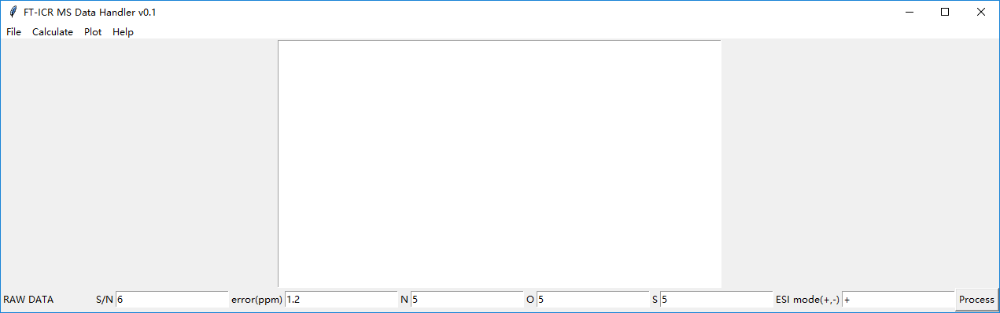
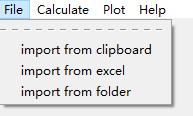
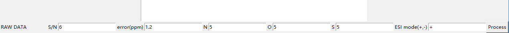
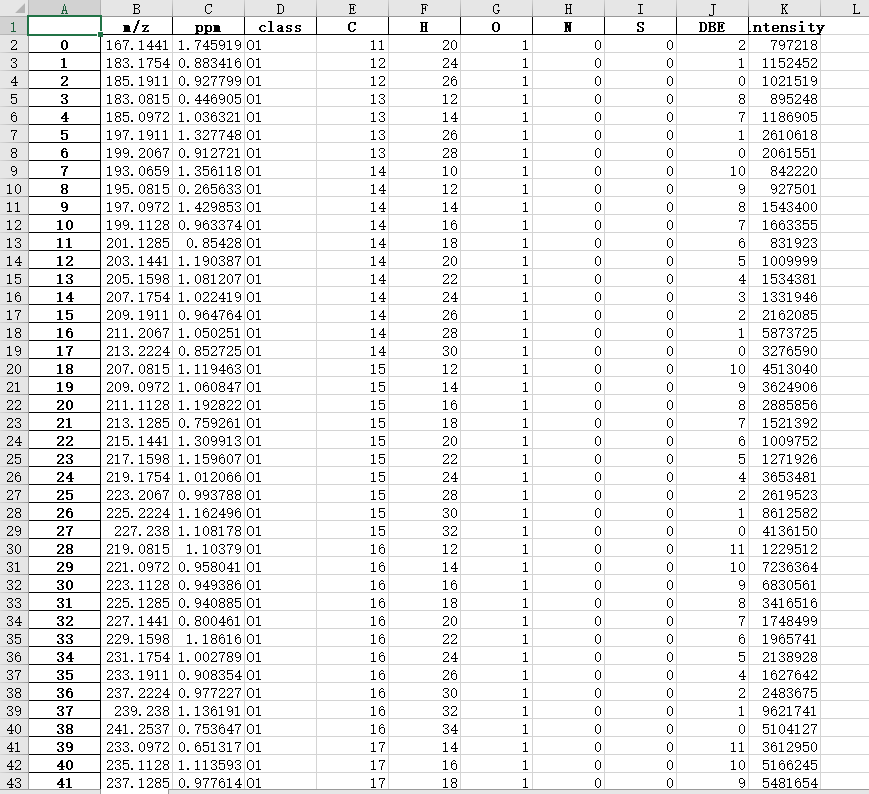

# FT–ICR MS Data Handler


## Note

This tool is being actively developed, so ANY feedback is welcome. Does everything work as expected? If not, let me know by opening an issue. Also, open a pull request if you find an issue you would like to fix. 


## Overview

*Polaris* is yet another utility for interacting with fticrms data.


## Installation

### From source (Recommended)

Simply download the source code 

```
git clone https://github.com/eko133/fticrms.git
```

or, the source code [package](https://github.com/eko133/fticrms/releases).

Install requirements:

```
pip3 install -r requirements.txt
```
Then, run `Polaris.py` in any python IDE.

On windows, the spyder included in [Anaconda](https://anaconda.org/) is highly recommended.


### Using binaries

#### Downloads


| **Filename**                                                 | **Version** | **Description** |
| ------------------------------------------------------------ | ----------- | --------------- |
| [Polaris_Windows_x64.zip](https://github.com/sliuweimin/polaris/releases/download/0.1.4/Polaris_Windows_x64.zip) | 0.1.4       | Windows 64-bit  |
| [Polaris_Darwin.zip](https://github.com/sliuweimin/polaris/releases/download/0.1.4/Polaris_Darwin.zip) | 0.1.4 | MacOS (only tested on 15.12) |

## Usage

### Main interface




### Step 1. Import file:



First, you should import the data that you want to proceed. Currently, this tool is capable of dealing with the following data sources:

- clipboard: simply copy data from Bruker Data Analysis and the magic happens.
- excel
- folder: have a lot of data files (excel)? Import them all at once!


### Step 2. Deal with data

- Process raw data and get possible chemical formulas: The imported raw data MUST have these information: 'm/z', 'I', and 'S/N'. To process raw data, you have to set some parameters. Adjustable parameters include: 

  - `S/N` only mass peaks that have singal-to-noise ratios above this value are included;

  - `error` chemical formulas that have abosulte errors higher than this value are discarded;

  - `N` maximum number of nitrogen heteroatoms;

  - `O` maximum number of oxygen heteroatoms;

  - `S` maximum number of sulfur heteroatoms;

  - `ESI mode` under which ESI mode is the raw data obtained, '+' or '-'.

  - The processed data is stored in Excel which look like this:

    ​


- Calculate class abundance and class DBE abundance
- Bar plot and bubble plot (beta) 

